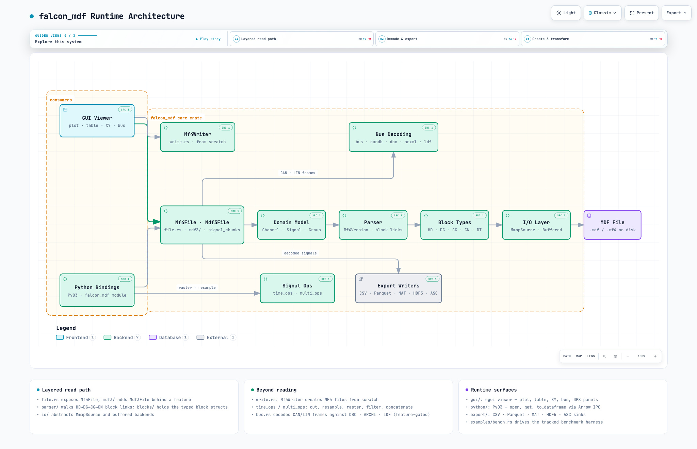

<div align="center">

<picture>
  <source media="(prefers-color-scheme: dark)" srcset="assets/logo-dark.png">
  
</picture>

**Fast, safe reading and writing of ASAM MDF measurement files, in Rust.**

[](https://crates.io/crates/falcon_mdf)
[](https://docs.rs/falcon_mdf)
[](#license)
[](https://mohammad-albarham.github.io/falcon_mdf/)

**[Installation](#installation) • [Quick start](#quick-start) • [Browser demo](https://mohammad-albarham.github.io/falcon_mdf/) • [Guides](https://mohammad-albarham.github.io/falcon_mdf/docs/) • [API docs](https://docs.rs/falcon_mdf)**

</div>

## About

falcon_mdf reads and writes MDF v4 (`.mf4`) and, optionally, MDF v2/v3 (`.mdf`)
files — the formats automotive and industrial loggers record CAN, LIN, Ethernet
and sensor data to. It ships as a Rust crate, [Python bindings](python/), a
[WebAssembly build](wasm/) and a [desktop viewer](gui/RUNNING.md).

**Try it without installing anything:** the
[browser demo](https://mohammad-albarham.github.io/falcon_mdf/) opens an `.mf4`
file and plots its channels client-side. The file never leaves your machine.

## Why falcon_mdf?

- **Correct, or it says so.** A channel decodes to the right values or fails
  with a reason — never partial data or raw values passed off as converted.
  Output is checked against asammdf over a corpus of CAN, LIN and GPS/IMU logs.
- **Safe on files you did not write.** Malformed input returns an error, not a
  panic, abort or hang. A sweep of 1,200 mutated files produces none of the
  three.
- **Fast, by an amount that depends on the file.** Against asammdf's
  `select()`: 4.5× faster on files over 1 MB (geometric mean, worst 1.8×), and
  1.8× on 122–480 MB files. See [Performance](#performance).

## Features

- **MDF 4.0–4.2**, sorted and unsorted, finished and unfinished; **MDF 2.x/3.x** behind `mdf3`
- **Every data layout:** DT/DZ/DL/HL/LD/DV/DI blocks, all six deflate/zstd/LZ4
  compression forms, VLSD signals, CA arrays, invalidation bits
- **Typed samples:** integers keep their width, payloads stay bytes, text stays text;
  conversions from linear and rational to formulas, value/range/text tables and bitfields
- **Bus logs:** CAN, LIN, Ethernet and FlexRay frames; CAN signals decoded
  against DBC or ARXML (J1939 and multiplexing included), LIN against LDF
- **Streaming:** bounded-window channel reads, and reading over HTTP range
  requests or any byte source
- **Tools:** `cut`, `resample`, `filter`, `concatenate`, `stack`, signal
  arithmetic, channel search, anonymisation, a full block map
- **Export** to CSV, Parquet, Arrow IPC, HDF5, MATLAB MAT (v4, v5, v7.3) and Vector ASC
- **Writing** MF4 from scratch or editing an existing file, with compression

The complete, versioned list — and how it compares with asammdf and other Rust
crates — is in the [field reference](docs/field-reference.html).

## Installation

```toml
[dependencies]
falcon_mdf = "0.7"
```

MSRV is **1.89** for every feature combination.

<details>
<summary>Feature flags</summary>

| Flag | Default | Enables |
|---|---|---|
| `mmap` | on | Memory-mapped I/O (`memmap2`) |
| `parallel` | on | Parallel decoding via `rayon` |
| `mdf3` | off | MDF 2.x/3.x reader |
| `dbc` / `arxml` | off | CAN databases from DBC files / AUTOSAR ECU extracts |
| `zstd` / `lz4` | off | Zstandard / LZ4 data blocks |
| `parquet` / `arrow` | off | Parquet / Arrow IPC export |
| `hdf5` | off | HDF5 export (pure Rust) |
| `mat` / `mat4` / `mat73` | off | MATLAB level 5 / v4 / v7.3 export |
| `asc` | off | Vector ASC trace export |

A block compressed with a codec that is not compiled in fails by name rather
than returning wrong bytes.

</details>

## Quick start

```rust
use falcon_mdf::{Mf4File, SignalValues};

fn main() -> Result<(), Box<dyn std::error::Error>> {
    let file = Mf4File::open("measurement.mf4")?;
    println!("MDF {} with {} channels", file.version(), file.channel_count());

    if let Some(channel) = file.find_channel("VehicleSpeed") {
        let signal = file.signal(channel)?;
        match signal.values()? {
            SignalValues::F64(v) => println!("first: {:?} {}", v.first(), signal.unit()),
            other => println!("{} samples of {}", other.len(), other.kind().name()),
        }
    }
    Ok(())
}
```

<details>
<summary>Decode a CAN bus log against a DBC</summary>

```rust
use falcon_mdf::{CanDatabase, IdMatching, Mf4File};

let file = Mf4File::open("truck.mf4")?;
let database = CanDatabase::from_dbc_path("j1939.dbc")?
    .with_matching(IdMatching::J1939Pgn);

for signal in file.decode_bus(&database)?.iter() {
    println!("{}.{}: {} readings [{}]", signal.message, signal.name, signal.len(), signal.unit);
}
```

</details>

<details>
<summary>Write an MF4 file</summary>

```rust
use falcon_mdf::Mf4Writer;

let mut writer = Mf4Writer::new();
let group = writer.add_group(&[0.0, 0.1, 0.2])?;
group.add_channel("Speed", "km/h", &[0.0, 5.0, 10.0])?;
writer.write_to_file("out.mf4")?;
```

</details>

<details>
<summary>Export channels to Parquet</summary>

```rust
use falcon_mdf::{Mf4File, export::write_parquet};

let file = Mf4File::open("measurement.mf4")?;
let series = file.filter(&["VehicleSpeed".into(), "EngineRPM".into()])?;
write_parquet(&series, &mut std::fs::File::create("measurement.parquet")?)?;
```

</details>

More in [`examples/`](examples/): `list_channels`, `export_to_csv`,
`write_mf4`, `decode_bus` and `block_map`.

## Performance

Whole-file reads against asammdf 8.7.2 `select()`, release build, median of
three runs on an Apple-silicon Mac (2026-09-27):

| Files | Speed-up |
|---|---|
| Over 1 MB (12 files), geometric mean | 4.5× (worst 1.8×) |
| 122 MB, transposed deflate | 1.8× |
| 480 MB, uncompressed | 1.8× |

Files under 100 KB show far larger ratios that mostly measure asammdf's
start-up cost. Per-file timings, memory and method are in
[`benchmarks/COMPARISON.md`](benchmarks/COMPARISON.md).

Memory-mapped I/O is the default. Use `Mf4File::open_buffered` for files another
process may still be writing or replacing.

## Limitations

- Arrays with more than one dynamically-sized dimension
- Variable-length arrays exported to CSV, MAT or HDF5 (Arrow and Parquet work)
- Lossless editing of arbitrary files: `Mf4Writer::from_file` may skip channels
  and metadata it cannot represent
- MDF 4.20 `##LD` chains whose separate invalidation needs incompatible layouts

Unsupported channels fail with `Mf4Error::Unsupported`, naming the feature;
the rest of the file still reads.

## Architecture

[](https://mohammad-albarham.github.io/falcon_mdf/architecture.html)

Click the map for the interactive version, with guided tours and links into the source.

## License

Licensed under either of [Apache License 2.0](LICENSE-APACHE) or
[MIT license](LICENSE-MIT), at your option.

## Documentation

The [guides and reference](https://mohammad-albarham.github.io/falcon_mdf/docs/)
live in `docs/site/`. Preview them with
`uvx --from zensical==0.0.65 zensical serve` and check links with
`uvx --from zensical==0.0.65 zensical build --strict`.
